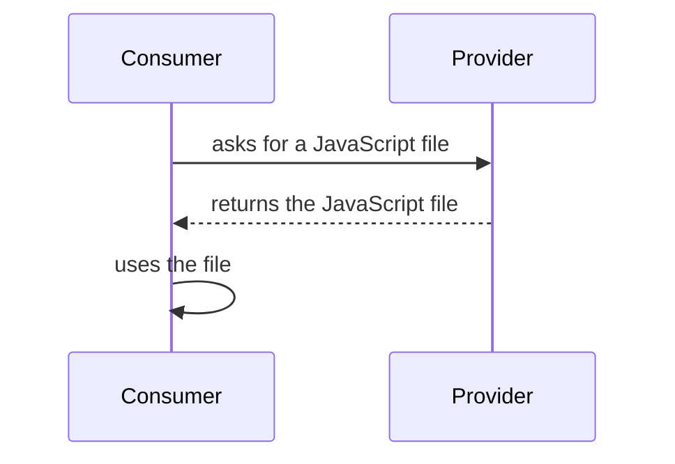
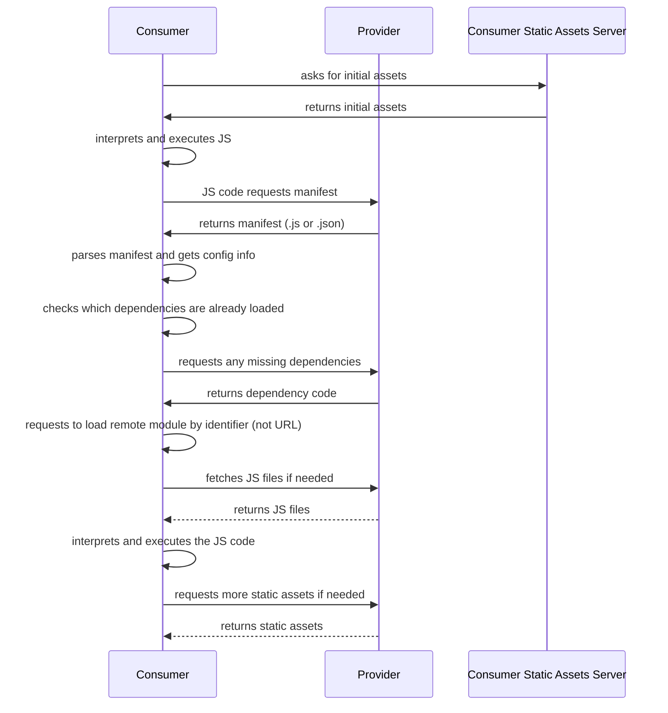

# How Module Federation 2.0 Runtime Works

**Or: How to Implement Module Federation Without Plugins**

**Note:** Unless otherwise stated, we assume we’re primarily implementing things for client-side rendering — for example, building a SPA.

## Before We Dive In: Some Definitions

### Provider
The app that exposes information (a manifest.json or .js) and usually the static assets.  
We may also call this the **remote**.  
A provider can contain one or more modules.

### Remote Module
For example, this could be a function or a set of functions contained in one JS file on the remote server that can be fetched dynamically.

### Consumer
The client-side app that consumes the static assets of a provider and, if needed, executes the code from those assets.  
In this article, we may also call this the **shell app**.  
It usually orchestrates and glues together the remote module code.

### Static Assets
Files usually of type HTML, CSS, and JS that are **not** generated on the fly by the server.  
Instead, these files are pre-generated and served as-is to all users — ideally every user gets exactly the same copy.

### Manifest
Configuration for module federation.  
It contains information such as the URLs from which to fetch the static assets.

---

## A Less Sophisticated Similar Idea to Start…

Before deep diving, let’s explain and implement the basic idea behind this.



Here, the provider exposes a "module" — self-contained code with a clear API for you to use.

You might say: “Well, that’s just like using a…”

```html
<script type="module" src="some.lib.min.js"></script>
```

or...

```html
<script type="module">
  const { someFunctionality } = await import("some.lib.min.js")
</script>
```

But what happens if some.lib.min.js depends on another library — say, dep.lib.min.js — and because it’s bundled, that dependency is already minified and included inside some.lib.min.js?

Now imagine your app shell also depends on dep.lib.min.js, but because you’re using modern tools, you bundled it into your own build. You’ve now duplicated that code, and you have no way to avoid it.

## One solution?
You can make that dependency “external” — meaning it must be loaded first, and only then can you use your library:

```js
await import("dep.lib.js")
await import("some.lib.min.js")
// My app shell code

```

Now you have to manage **loading order**.
With lots of libraries, this becomes repetitive and error-prone. This is where an abstraction helps.

Module federation aims to solve this (and other) problems. Let’s see how.

## Module Federation Flow


## Do We Need a Plugin and a Bundler to Implement This?
- \- **Consumer**: No.

- \- **Provider**: Realistically, yes — unless you want to reimplement the manifest contract and asset generation logic yourself.

For the consumer, you can use an enhanced runtime, configure it in your code, and start consuming federated modules right away.

## Design Principles
Before jumping into a use case, here are some principles I’ve found useful:

- \- Remote modules should be stateless.

- \- The app shell is the glue code.

- \- Expose behavior as part of your module’s API — let the shell configure it.

- \- Think of these modules like libraries.

- \- Avoid hardcoding defaults or implementing every possible behavior. Instead, expose generalizations, and offer optional “plug-and-play” defaults as separate modules.

- \- Minimize side effects in remote modules (e.g., running code on load or modifying global scope).

- \- And remember: browsers mainly run JavaScript, CSS, and HTML. If I use Docker or another tool, that’s just for my build pipeline — not a requirement. The static asset generation process depends entirely on your available tools and stack.

## Exploration: A Simple Playground

If you want to try this locally, check [this reposittory](https://shadowrunner8095.github.io/module-federation-examples).

For our example, I’ve exposed a module-federation.js bundle that contains the entire runtime (not ideal for production — this is just for learning) and a provider ready for you to consume.

An implementation of this [is running online](https://shadowrunner8095.github.io/module-federation-examples/)

Let’s try it — even without bundler integration — to see what happens.

The provider exposes a function that creates a terrible modal (it can’t be closed). Imagine you need to show that modal only when the user scrolls for the first time, with a 500 ms delay:

```html
<script type="module">
  import mf from 'https://shadowrunner8095.github.io/module-federation-examples/mf-bundle.js'

  const mfInstance = createInstance({
    name: 'consumer',
    remotes: [
      {
        entry: 'https://shadowrunner8095.github.io/module-federation-examples/provider/mf-manifest.json',
        name: 'modal',
        alias: 'modal',
      }
    ],
  })

  async function scrollListener() {
    const { createModal } = await mfInstance.loadRemote('modal')
    setTimeout(createModal, 500)
    this.removeEventListener('scroll', scrollListener)
  }

  addEventListener('scroll', scrollListener)
</script>

<div style="min-height:120vh;">
   Hello, scroll this page please
</div>

```

Congrats — you’ve just consumed a remote modal!

Notice we exposed a function instead of executing immediately.
Why? Because providers shouldn’t decide when things happen — the consumer is the orchestrator.

## Is This the Only Way to Consume?
No. For example, rsbuild has a plugin that hides all this complexity — you can import a federated module just like any other, and the bundler rewrites the code appropriately.

This manual approach is just for exploration. Open DevTools, scroll, and see the assets load lazily in the network tab — the runtime only fetches the modal module when loadRemote is called.

## I Have an SSR Site With Rust, Go, PHP…

You can learn a lot from the example’s source code, but you don’t have to port everything to your backend language.
You can still use rsbuild for bundling — as long as you can serve static files, the process is:

1. Set up rspack/rsbuild in your build environment (needs Node.js).

2. Configure the module federation plugin with the proper remote URLs.

3. Create an HTML entry point that imports your remotes and orchestrates rendering.

4. Run the build.

5. Move the output files to the folder your server uses for public static assets.

6. Configure your server to serve them correctly (for SPAs, remember to set up rewrites).

If you just need to load an entire app from a provider, module federation also supports a “bridge” mode.

## Goodbye
More complex implementations are on the way — that’ll be part two.
I also have some blog generator enhancements to finish first.

